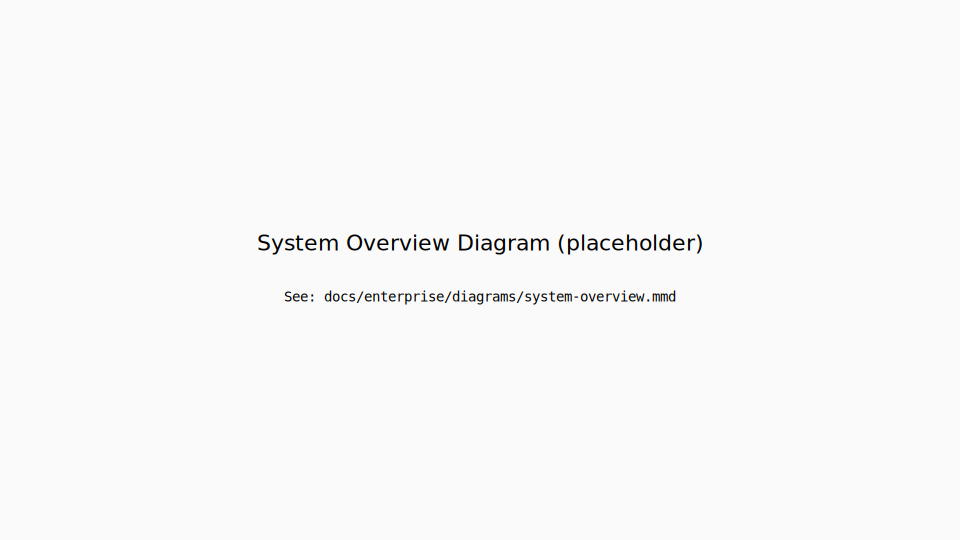

# AiduxCare — Enterprise Architecture Blueprint (v1)

**Market:** CA · **Language:** en-CA  
**Date:** 2025-10-06

---

## Executive Summary
AiduxCare is a compliance-first clinical documentation platform for physiotherapists and allied health professionals in Ontario, Canada.  
Our stack integrates **React + TypeScript** (frontend), **Firestore** (backend), **Vertex AI** (AI layer), and **GitHub Actions** (CI/CD).  
Design principles:
- Compliance-first (PHIPA/PIPEDA/CPO)
- Predictable, observable AI behaviour
- Immutable auditability

---

## 1. System Overview


**Layers**
| Layer | Tech | Description |
|-------|------|-------------|
| Frontend | React (Vite+TS) | SOAP interface & clinician workflows |
| Backend | Firestore | Source of truth for notes, visits, metrics |
| AI Layer | Vertex AI / Langfuse | Summarization & compliance checks |
| Compliance | PHIPA Guardrails | Prevents PII in logs, immutable signed notes |
| CI/CD | GitHub Actions | Typecheck, lint, test, and infra-protection |

---

## 2. Data Architecture
| Collection | Purpose | Key Indexes | Retention |
|-------------|----------|--------------|------------|
| `notes` | SOAP notes | `(patientId, status, createdAt desc)` | 7 years |
| `audit_logs` | Change history | `(entityId, timestamp)` | 10 years |
| `consents` | Patient consents | `(patientId, active)` | 10 years |

Erasure follows PHIPA/PIPEDA guidelines.  
(See ADR-004 “Retention and Erasure Policy”)

---

## 3. Security & Compliance
- Firestore rules:  
  - Immutable when `status === "signed"`.
  - Only clinician with matching UID can write.
- Logs: No SOAP content, only metadata.
- Feature flags for controlled rollouts.

---

## 5. CI/CD & Environments
| Env | Branch | Deployment | Purpose |
|------|---------|-------------|----------|
| `main` | Production | Vercel | Canada-first |
| `develop` | Staging | Vercel Preview | QA / Compliance runs |
| Feature branches | — | Local + PR | Validated via SoT Guardian |

Workflows:
- `tsc`, `eslint`, `vitest`
- `protect-infra.yml` for restricted areas

---

#### 6.3 Vertex AI Inference & Fallback

La generación usa tiempos límite por capa, **retries exponenciales** y **fallback** a un segundo modelo cuando el primario falla por errores transitorios o P95 de latencia elevado.

```ts
// ai/generate.ts
type ModelId = 'vertex-default' | 'vertex-fallback';

async function sleep(ms: number) { return new Promise(r => setTimeout(r, ms)); }

async function withRetry<T>(fn: () => Promise<T>, attempts = 2, baseMs = 400): Promise<T> {
  let err: unknown;
  for (let i = 0; i <= attempts; i++) {
    try { return await fn(); } catch (e) {
      err = e;
      if (i === attempts) break;
      await sleep(baseMs * Math.pow(2, i)); // backoff exponencial
    }
  }
  throw err;
}

async function callVertex(model: ModelId, prompt: unknown, timeoutMs = 15000) {
  const ctrl = new AbortController();
  const t = setTimeout(() => ctrl.abort(), timeoutMs);
  try {
    // Pseudocódigo: sustituir por SDK/HTTP real
    return await fetch(`/vertex/${model}`, {
      method: 'POST', body: JSON.stringify(prompt), signal: ctrl.signal
    }).then(r => r.json());
  } finally { clearTimeout(t); }
}

export async function generateSOAP(prompt: unknown) {
  try {
    return await withRetry(() => callVertex('vertex-default', prompt));
  } catch {
    // Fallback inmediato a un modelo alternativo (menor costo/latencia)
    return await withRetry(() => callVertex('vertex-fallback', prompt));
  }
}
#### 6.4 PII Guard (pre/post)

Se aplican sanitizadores antes de la inferencia (transcript) y después (nota JSON) para minimizar PHI/PII en tránsito y en almacenamiento secundario (logs/traces).

```ts
// pii/guard.ts
const PHONE = /\b(?:\+?\d{1,2}\s?)?(?:\(?\d{3}\)?[-.\s]?)\d{3}[-.\s]?\d{4}\b/g;
const EMAIL = /\b[A-Za-z0-9._%+-]+@[A-Za-z0-9.-]+\.[A-Za-z]{2,}\b/g;
// HCN: placeholder, ajustar por provincia/validador real
const HCN = /\b[A-Z]{4}\d{4}\b/g;

export function redactPII(s: string) {
  return s
    .replace(PHONE, '[REDACTED:PHONE]')
    .replace(EMAIL, '[REDACTED:EMAIL]')
    .replace(HCN,   '[REDACTED:HCN]');
}

export function preSanitizeTranscript(t: string) {
  return redactPII(t).trim();
}

export function postSanitizeNote(jsonText: string) {
  return redactPII(jsonText);
}
#### 6.5 Langfuse Traces & EVALs

Cada generación crea una **traza** con `traceId`, `modelId`, `promptVersion`, `latencyMs`, `tokens` y costo estimado. Los **EVALs** se ejecutan post-generación (reglas heurísticas o rúbrica) y devuelven **completeness**, **timeliness** y **legibility**. Umbrales propuestos: *soft* ≥ 0.90/0.95/0.90; *hard floor* ≥ 0.80/0.85/0.80. **Acciones**: si cae bajo *hard* → *block* (no persistir, requiere revisión); bajo *soft* → *flag* (persistir con revisión); en rango → *accept* (flujo normal).

```ts
// observability/langfuse.ts
type EvalScores = { completeness: number; timeliness: number; legibility: number };
const HARD_FLOOR = { completeness: 0.80, timeliness: 0.85, legibility: 0.80 };
const SOFT_MIN   = { completeness: 0.90, timeliness: 0.95, legibility: 0.90 };

export async function traceAndEval(
  lf: any,
  meta: { clinicianId: string; modelId: string; promptVersion: string },
  gen: () => Promise<string>
) {
  const trace = await lf.trace({ name: 'soap-gen', userId: meta.clinicianId, meta });
  const t0 = Date.now();
  const note = await gen();                   // ejecución del modelo (inyectado)
  const latencyMs = Date.now() - t0;

  // Placeholder: sustituir por runner de EVALs reales (Langfuse/propio)
  const scores: EvalScores = await lf.evaluate(note, { rubric: 'soap-v1' });

  await lf.event(trace, { name: 'evals', data: { ...scores, latencyMs, ...meta }});

  const belowHard = (scores.completeness < HARD_FLOOR.completeness)
                 || (scores.timeliness   < HARD_FLOOR.timeliness)
                 || (scores.legibility   < HARD_FLOOR.legibility);
  const belowSoft = (scores.completeness < SOFT_MIN.completeness)
                 || (scores.timeliness   < SOFT_MIN.timeliness)
                 || (scores.legibility   < SOFT_MIN.legibility);

  const action = belowHard ? 'block' : (belowSoft ? 'flag' : 'accept');
  return { note, scores, latencyMs, action, traceId: trace.id };
}
#### 6.6 Persistence & Metadata

La nota se **persiste** junto con metadatos que habilitan auditoría y observabilidad sin exponer PHI en logs. Campos mínimos:
- `encounterId`, `clinicianId`, `createdAt`, `signed=false`
- `ai.modelId`, `ai.promptVersion`, `ai.latencyMs`, `ai.evals` (completeness/timeliness/legibility)
- `ai.action` ∈ {`block`,`flag`,`accept`} y `ai.traceId` (Langfuse)
- `checksum/signHash` se calcula cuando el clínico **firma** (bloqueo inmutable)

Política:
- **block** → no persistir contenido (se abre ticket / revisión).
- **flag** → persistir con marca y requerir revisión antes de firmar.
- **accept** → persistir normalmente. Siempre sin PHI en logs y con `traceId`.

```ts
// persistence/save.ts
type Evals = { completeness: number; timeliness: number; legibility: number };
type SaveInput = {
  noteJson: string; // JSON SOAP en string
  meta: {
    encounterId: string; clinicianId: string;
    modelId: string; promptVersion: string;
    latencyMs: number; evals: Evals; action: 'block'|'flag'|'accept';
    traceId: string;
  };
};

export async function persistNote(db: any, input: SaveInput) {
  // Nunca loggear noteJson sin sanitizar
  if (input.meta.action === 'block') {
    return { saved: false, reason: 'evals_below_hard_floor', traceId: input.meta.traceId };
  }
  const doc = {
    encounterId: input.meta.encounterId,
    content: JSON.parse(input.noteJson), // validar contra schema antes
    signed: false,
    createdAt: new Date().toISOString(),
    createdBy: input.meta.clinicianId,
    ai: {
      modelId: input.meta.modelId,
      promptVersion: input.meta.promptVersion,
      latencyMs: input.meta.latencyMs,
      evals: input.meta.evals,
      action: input.meta.action,
      traceId: input.meta.traceId
    }
  };
  // Pseudocódigo: sustituir por SDK real (Firestore/SQL)
  const ref = await db.collection('notes').add(doc);
  return { saved: true, id: ref.id, traceId: input.meta.traceId };
}
```
#### 6.7 Risks & Mitigations
- **Model drift**: monitoreo mensual y canary con EVALs; si cae el score medio ≥3 pts o p95 ≤ soft-min → rollback de **promptVersion/modelId** vía feature flag. Backtesting trimestral con set curado.
- **Latencia**: budgets por etapa (ASR, build, LLM, sanitize). P95 objetivo ≤ 8 s end-to-end; segmentación ≤60 s, pre-warm de runtimes y concurrencia limitada; streaming parcial cuando aplique.
- **Costos**: límites de tokens/request y por usuario/día; ruteo dinámico a **modelos económicos** en casos low-risk; batch y caché para prompts idénticos dentro del encounter.
- **OOS inputs**: detección de idioma/ruido alto → degradar a plantilla básica y pedir confirmación humana; ASR fail → reintentos con chunking alternativo; profanity/PHI excesiva → sanitizar/abortar.
- **Alucinaciones / nuevos hechos**: regla “**no new facts**” + verificador de **cobertura de citas**; si coverage < 0.85 → *flag*; si < 0.70 → *block*.
- **Privacidad**: PII guard pre/post, cero PHI en logs, cifrado en tránsito/at-rest; acceso a trazas restringido (principio de menor privilegio).
- **Disponibilidad**: timeouts, retries, **circuit-breaker**, colas con reintentos e **idempotency key**; redundancia regional para el proveedor de LLM.

#### 6.8 Observability & Retention
**Campos mínimos de traza**: `traceId`, `encounterId` (hash), `clinicianId` (pseudónimo), `modelId`, `promptVersion`, `tokensIn/out/total`, `latencyMs`, `inputDurationSec`, `evalScores`, `action` (accept/flag/block), `errorCode`, `costUsd`, `region`, `sampleRate`, `env`.
**Muestreo**: 100% en canary y errores; 20% en normal (dinámico por carga). **Alertas**: P95>8s (15m), error rate>2% (5m), caída de *accept rate*<85% (30m), desviación de costos>20% semanal.
**SLOs**: disponibilidad ≥99.9% mensual; P95 end-to-end ≤8 s; *accept rate* ≥90% semanal. **Retención**: trazas crudas 30 días; métricas agregadas 180 días; export sanitario a BI; sin PHI en logs. **Accesos**: SRE/ML con auditoría activa.
#### 6.9 Observability & Retention
Definimos un esquema mínimo de trazas para gobernanza y costos: `traceId`, `modelId`, `promptVersion`, `latencyMs`, `tokens_in/out`, `cost_estimate`, `action{accept|flag|block}`, `clinicianRef(hash)`, `encounterRef(hash)`, `env`. **Muestreo**: 100% en beta, 20–30% en prod con *bursting* a 100% ante incidentes. **Retención**: 30 días para eventos crudos y 180 días para agregados (P50/P95, tasa de error, costo por nota). **Privacidad**: cero PHI/PII en trazas; acceso por RBAC de solo lectura; export programático a dashboard semanal para liderazgo clínico. Alarmas: latencia P95, error-rate y caída de *soft scores* de EVALs, con playbooks de respuesta (rollback de prompt, activar fallback, elevar muestreo, abrir ticket).

#### 6.10 Riesgos & Mitigaciones (ampliado)
**Model drift**: panel mensual de drift semántico y *shadow evals* con prompts pinneados; si el *accept rate* cae ≥5 pp, gatillar revisión de prompt/modelo. **Latencia y costos**: límites por usuario/ día, **budgets** por entorno, y *gates* de P95 por endpoint; cacheo de prompts inmutables y compresión de contexto. **OOS inputs**: detección de idioma, duración y nivel de ruido; respuestas “conservative/uncertain” cuando falta evidencia. **Alucinaciones**: “no new facts” + esquema JSON validado; citas por span obligatorias. **Resiliencia**: *timeouts* por capa, reintentos con *backoff*, *circuit-breaker* por servicio y *regional failover* donde esté disponible. **Seguridad**: claves KMS rotadas, RBAC estricto para observabilidad y auditoría end-to-end con `traceId`. Estas medidas permiten mantener calidad clínica, previsibilidad de costos y tiempos de recuperación operativa bajo SLA.
#### 6.11 Observabilidad & SLOs

- **Campos de traza mínimos**: `traceId`, `spanId`, `modelId`, `promptVersion`, `inputChars`, `outputChars`, `promptTokens`, `completionTokens`, `latencyMs`, `status` (`accept|flag|block`), `retryCount`, `fallbackUsed`, `costUsd`.
- **Muestreo**: 100% para `flag`/`block` y errores; 10% para `accept` en prod; 100% en preprod/staging.
- **SLOs**: disponibilidad ≥ **99.5%** mensual; **P95** inferencia ≤ **6 s**; **P95 e2e** (transcripción→persistencia) ≤ **12 s**.
- **Error budget**: si el consumo semanal > **2%** → *feature freeze*, rollback de prompt/modelo y revisión de gates.
- **Alertas**: (a) P95 > 2×SLO por 10 min; (b) tasa `block` > **5%** en 30 min; (c) costo por nota > umbral; (d) fallbacks > **10%** de requests.
- **Retención**: trazas **90 días**; resúmenes de EVAL **180 días**; **no** se guarda audio crudo en trazas/logs; solo hashes/refs.
- **Dashboards**: latencia por etapa, tasa de reintentos, distribución de *scores* (completeness/timeliness/legibility), costo por clínica.

#### 6.12 Riesgos & Mitigaciones

- **Model drift**: *canary* semanal con *baseline set*; recalibración mensual; alerta por caída de media > **5%** o P95 peor en **10%**.
- **Inputs OOS**: clasificador ligero + regla *defer* (“insufficient evidence”) cuando el transcript no alcance cobertura mínima.
- **Alucinaciones**: *no-new-facts* + citación de spans obligatoria + validación por esquema **JSON**; bloquear si el *parser* falla.
- **Costos**: *rate limits* por usuario/organización, presupuestos y alertas; cachear prompts idénticos por visita cuando aplique.
- **Privacidad**: *redaction* pre/post, DLP en canal de logs, “no PHI in logs”, cifrado en tránsito y en reposo (hereda §4).
- **Vendor lock-in**: capa de abstracción de proveedor (drivers) y *feature flags* por modelo para alternar Vertex/otros.
- **Latencia**: *fallback* y *circuit-breaker* por servicio; *backoff* exponencial; paralelizar limpieza/segmentación.
- **Resiliencia**: *timeouts* por capa, *idempotency keys* en persistencia, *dead-letter queue* para re-procesos controlados.
#### 6.13 Operational Playbook
- **Runbooks**: arranque en frío, incidentes, error budget; **SLOs**: success ≥ 99.0%, P95 ≤ 6s.
- **Paging**: alertas por caída de EVAL, backlog en colas, fallas API, y **spikes de costo**.
- **Rollouts**: canary 5% → 25% → 100%; **rollback automático** ante brecha *soft/hard*.
- **Data handling**: retención mínima de transcriptos; **purga** de adjuntos tras persistencia; PHI scrubbing en trazas; opt-in de redacción relajada solo para cohortes aprobadas de investigación.
- **Acceso**: **least privilege**, auditoría *break-glass*, review en 2 pasos para cambios de prompt.
- **Testing**: red-team de prompts; inputs adversarios (acentos OOS, solapamiento de voces); **chaos** para timeouts y degradaciones.

#### 6.14 Risk Register & Mitigations
- **Model drift**: seguimiento de tendencias de EVAL; refresco de prompts o ajuste de ejemplos; *shadow evals* con datos recientes.
- **Latencia/costos**: chunking adaptativo, **token caps**, caché; fallback a modelo más pequeño cuando P95 o costo/nota superen umbral.
- **Hallucinations / nuevos hechos**: esquema de salida **constrained**, citación de spans y validadores post-hoc de consistencia.
- **Privacidad**: defensa en profundidad (PII guard + RBAC/RLS + filtros de logs); **playbook** de incidentes y notificación.
- **Vendor lock-in**: capa de abstracción sobre proveedores; formatos portables de prompts/evals.
- **Regulatorio**: mapeo PHIPA/PIPEDA; **evidencias** vía trazas Langfuse y audit trail.
## 6. AI/ML Architecture

### Executive Summary
- **Controlled pipeline:** Audio → Whisper → Cleaner/Segmentation → Prompt Builder (versioned) → Vertex AI → Sanitizer → Persistence.
- **Clinical compliance:** EVALs (Langfuse) score **completeness**, **timeliness**, and **legibility**; below-threshold outputs are **flagged** or **blocked**.
- **Traceability:** every invocation captures **modelId**, **promptVersion**, **latency**, **tokens**, and **estimated cost** linked to a **traceId**.
- **Safety/PHI:** pre/post PII guards; **no PHI in logs**; span citations; length/vocabulary validators.
- **Resilience:** per-stage **timeouts**, **exponential retries**, **fallback model**, and **circuit-breaker** on error rate/latency.
- **Observability:** dashboards for latency/error/drift; alerting on degradation; sampled traces with retention policy.
- **Feature flags:** gradual rollouts (canary), per-clinic/user gating, instant rollback on gate failures or P95 spikes.


#### 6.1 Transcription (Whisper)
Audio (streaming or file) is pre-processed with VAD/normalization. We segment into ≤60-second chunks (≈250 ms overlap) and run **Whisper** (large-v3 or a managed service). Output includes timestamps/diarization and quality metrics (confidence/SNR). Typical errors: timeouts (→ retry with backoff), oversize chunks (→ re-segment), poor SNR (→ add “uncertain” tag to push the generator to conservative outputs). Diarization is preserved to support span-level citations.

#### 6.2 Prompting & Versioning
The **Prompt Builder** assembles clinical context with **SemVer** prompts. We enforce **en-CA** and a **strict JSON SOAP** schema. The model must not invent facts and must **cite transcript spans** `[t_start, t_end]`. Prompt changes are documented in a dedicated CHANGELOG and released via **feature flags** for canary/rollback.

```ts
// PromptFactory.ts
export type PromptMeta = { version: string; locale: 'en-CA' };
export const PROMPT_VERSION = '2.1.0'; // tracked in a prompts CHANGELOG

export function buildClinicalPrompt(input: {
  transcript: string; encounterId: string; visitDate: string;
}, meta: PromptMeta) {
  return {
    meta,
    system: [
      'You are a clinical scribe.',
      'Output strictly JSON SOAP (en-CA).',
      'Do not invent facts. Cite transcript spans as [t_start,t_end].'
    ].join(' '),
    user: `TRANSCRIPT:\n${input.transcript}\n\nOutput keys: subjective, objective, assessment, plan`,
    constraints: { maxTokens: 1400, temperature: 0.2 }
  };
}
## 4. Security Architecture

### Executive Summary
- Cifrado end-to-end: datos en reposo (AES-256, claves rotadas) y en tránsito (TLS 1.2+ con HSTS).
- RLS restringe acceso por paciente/clinician bajo mínimo privilegio.
- RBAC con 3 niveles (admin / clinician / read-only) y permisos declarativos.
- Notas firmadas inmutables; auditoría criptográfica de eventos PHI.
- MFA, sesiones cortas y rotación/revocación de tokens.
- Controles PHIPA/PIPEDA + pruebas periódicas de backup/restore.

### Encryption Architecture
**At rest.** PHI cifrada con AES-256; claves en KMS (CMEK), rotación programada y separación de deberes.  
**In transit.** TLS 1.2+ con HSTS; ciphers débiles deshabilitados; certificate pinning en móviles.  
**Secrets.** En secret manager; CI con scopes mínimos (principio Zero-Trust).

### RBAC Model
| Role      | Read patient | Write notes | Sign notes | Manage users | View audit |
|-----------|--------------|-------------|------------|--------------|------------|
| admin     | ✔︎ all       | ✔︎ all      | ✔︎         | ✔︎           | ✔︎         |
| clinician | ✔︎ own       | ✔︎ own      | ✔︎ own     | ✘            | limited    |
| read_only | ✔︎ scoped    | ✘           | ✘          | ✘            | limited    |

“own” = pacientes asignados al clinician o creados por él.

### Auth Flow

Ver `docs/enterprise/diagrams/auth-flow.svg`.  
1) Usuario → MFA → `id_token` + `access_token`  
2) Backend valida firma/claims; emite sesión corta  
3) Autorización = RBAC + RLS  
4) Refresh tokens rotados y revocables

### Row-Level Security Policies (Postgres/Supabase)
Habilitar RLS por tabla. Ejemplo para `notes`.

```sql
-- Requisitos previos
ALTER TABLE notes ENABLE ROW LEVEL SECURITY;

-- 1) Clinician solo lee notas de sus pacientes
CREATE POLICY clinician_read_own ON notes
FOR SELECT
USING (
  auth.uid() = clinician_id
);

-- 2) Clinician inserta notas propias y de pacientes asignados
CREATE POLICY clinician_insert_own ON notes
FOR INSERT
WITH CHECK (
  auth.uid() = author_id
  AND EXISTS (
    SELECT 1 FROM patient_clinicians pc
    WHERE pc.patient_id = notes.patient_id
      AND pc.clinician_id = auth.uid()
  )
);

-- 3) Notas firmadas no se pueden actualizar
CREATE POLICY update_unless_signed ON notes
FOR UPDATE
USING (NOT signed)
WITH CHECK (NOT signed);

-- 4) Admin acceso total
CREATE POLICY admin_all ON notes
FOR ALL
USING (is_admin(auth.uid()))
WITH CHECK (is_admin(auth.uid()));
## Section 7 — Observability & Auditability

**Goal.** End-to-end visibility (client ↔ edge ↔ API ↔ DB) while meeting **CPO/PHIPA/PIPEDA** expectations for immutable audit trails. Telemetry is minimised, pseudonymised, and purpose-bound.

**Scope.**
- **Observability:** metrics, logs, traces with OpenTelemetry (OTel) or equivalent.
- **Auditability:** append-only audit events for clinical/admin actions (auth, policy decisions, CRUD of clinical records).

**Principles.**
1. **Canada-first.** Exporters and stores are CA-hosted by default; no cross-border routing by default.
2. **PII minimisation.** No raw patient identifiers in logs/traces. Use short-lived `trace_id` and hashed `entity_ref`.
3. **Separation of concerns.** Ops telemetry ≠ legal/compliance audit log.
4. **Integrity.** Audit events are append-only with periodic hash-chain anchoring and verifiable reports.
5. **Least-privilege & redaction.** Access via RBAC; server-side scrubbers remove direct identifiers.

**Signals we collect.**
- **Metrics:** latency (p50/p95/p99), error rate, RLS denies, queue depth, token usage.
- **Traces:** service path across web → edge → API → DB with `request_id`, `actor_role`, `entity_ref`.
- **Logs:** structured JSON, level-gated, redacted by default.
- **Audit events:** `who / what / when / where / why / how`, signed and chained.

**Data flow (high level).**
Browser/Client → Edge → API →  
• O11y pipeline: Collector (CA) → metrics/traces/logs store (CA).  
• Audit pipeline: append-only table/bucket + nightly integrity report and legal-hold workflow.

**Retention.**
- Metrics/Traces: **30–90 days** (ops).  
- Logs: **30 days** (unless incident).  
- Audit: **7–10 years** (per regulator and legal hold).

**Access & tooling.**
- Engineering: dashboards and traces via RBAC; production access is read-only.
- Compliance/Privacy: audit viewer with filters by patient, actor, action, date; export to PDF/CSV with case ID.
- All accesses to audit data are themselves audited.

**Incident mode.**
A feature flag raises verbosity for a bounded window; the activation itself is an audit event including justification and owner. Reverts automatically when the window ends.

**Compliance mapping (summary).**
- **CPO**: documentation of assessments/interventions, access history, and disclosure logs supported via audit events.
- **PHIPA/PIPEDA**: safeguards (integrity, access control, retention), minimal collection, and breach investigation supported by the o11y + audit pipelines.

**Acceptance criteria.**
- Default routing and storage in **CA**; no identifiers in traces/logs.
- Audit writes are append-only and verifiable; nightly integrity report generated.
- Dashboards show latency/error SLOs and RLS-deny counters.
- Role-based access in place; all audit-viewer sessions recorded.


