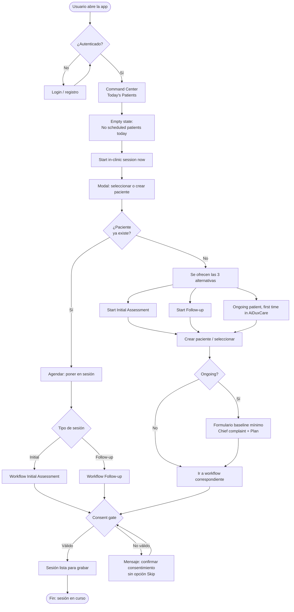

# Flujograma: Login → Agendamiento rápido (Command Center)

**Referencia:** WO-UX-01 Command Center Fast Path.  
**Objetivo:** Sistema para agendar pacientes de manera rápida: si existe solo se agenda; si no existe se ofrece una de las 3 alternativas (tarjetas).

---

## Diagrama (Mermaid)

---

## Flujo en pasos (texto)

| Paso | Pantalla / acción | Notas |
|------|-------------------|--------|
| 1 | **Login** | Si no está autenticado, login/registro. |
| 2 | **Command Center** | Pantalla principal. Bloque "Today's Patients" con empty state. |
| 3 | **"Start in-clinic session now"** | CTA principal → scroll a Work with Patients + abre modal de paciente. |
| 4 | **Modal: seleccionar o crear paciente** | Buscar paciente existente o "Create New Patient". |
| 5a | **Si el paciente existe** | Solo se agenda: elegir tipo de sesión (Initial Assessment o Follow-up) → ir al workflow. |
| 5b | **Si el paciente no existe** | Se muestran las 3 tarjetas: Start Initial Assessment, Start Follow-up, Ongoing patient first time. |
| 6 | **Según tarjeta** | Crear paciente (y si es Ongoing, completar formulario baseline mínimo) → ir al workflow. |
| 7 | **Consent gate** | Si no hay consentimiento válido, mensaje claro; no hay Skip. |
| 8 | **Sesión lista** | Workflow (Initial o Follow-up) listo para grabar. |

---

## Resumen de ramas

- **Paciente existe:** Agendar = elegir Initial o Follow-up y abrir workflow (≤3 acciones desde CC).
- **Paciente no existe:** Una de las 3 alternativas (tarjetas) → crear/registrar → según caso, formulario Ongoing → workflow.

Este documento puede usarse en guías de usuario o en refinamiento de WO-UX-01.
